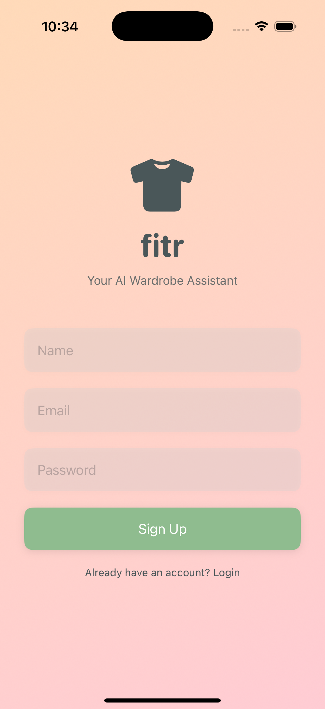
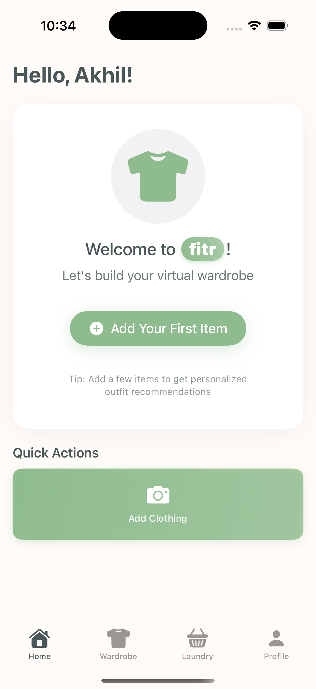
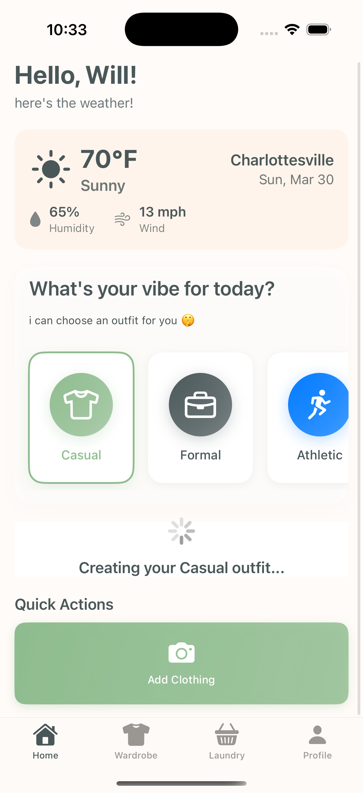
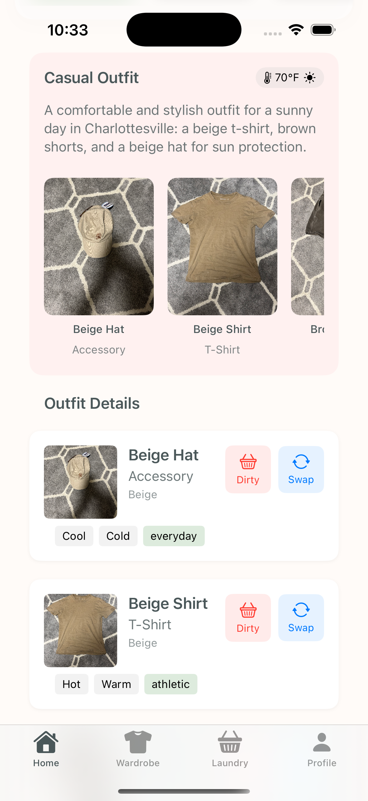
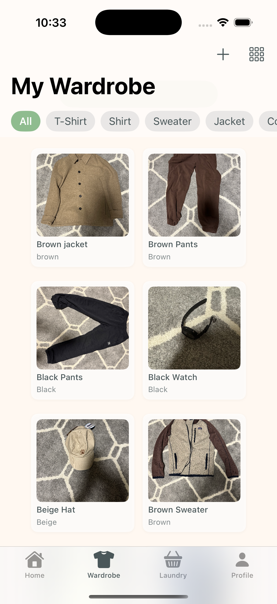

# fitr — Your Personal Outfit Assistant

Never struggle with "what to wear" again. fitr combines your wardrobe, the
local weather and your mood into an outfit recommendation.

fitr is a SwiftUI iOS app plus a Flask backend. The app handles accounts,
wardrobe management and the UI; the backend does CLIP image embeddings, vector
search, weather lookup and Gemini-based outfit generation.

## Screenshots

 

 



---

## Architecture

```
┌──────────────────────────┐        ┌─────────────────────────────────────┐
│ iOS app (SwiftUI)        │        │ Flask backend (Python 3.12, CPU)    │
│                          │        │                                     │
│  Firebase Auth ──────────┼───ID───▶  auth: verify Firebase ID token     │
│  Firestore (profiles,    │  token │                                     │
│    wardrobe metadata)    │        │  CLIP ViT-B/32                      │
│  Firebase Storage        │  HTTP  │    image tower → garment vectors    │
│    (wardrobe images)     ├───────▶│    text tower  → situation vector   │
│  Kingfisher (image cache)│        │                                     │
│                          │        │  PostgreSQL 15 + pgvector 0.8.6     │
│  BackendService.swift ───┼───────▶│    HNSW cosine k-NN                 │
│                          │        │    embedding cache (content-addr.)  │
└──────────────────────────┘        │                                     │
                                    │  OpenWeatherMap → conditions        │
                                    │  Gemini         → ranks shortlist   │
                                    └─────────────────────────────────────┘
```

**How a recommendation is produced**

1. Resolve the weather for the user's location (1-hour TTL cache).
2. Describe the situation in words — *"a photo of a casual outfit to wear in
   cold rainy weather"* — and embed that with CLIP's **text** tower.
3. Cosine k-NN in Postgres against the CLIP **image** embeddings of the user's
   clean garments, served by an HNSW index.
4. Send that shortlist — not the whole wardrobe — to Gemini, which returns up
   to three ranked outfits as structured JSON.

CLIP is what bounds the prompt, so the Gemini call costs the same whether the
wardrobe holds 20 garments or 2,000.

### Tech stack

| Layer | Technology |
|---|---|
| iOS | SwiftUI, Kingfisher |
| Accounts & profiles | Firebase Authentication |
| Metadata & images | Cloud Firestore, Firebase Storage |
| Backend | Flask 3.1, SQLAlchemy 2.0, psycopg 3 |
| Image recognition | CLIP ViT-B/32 (`openai/clip-vit-base-patch32`) via HuggingFace transformers, CPU-only |
| Vector store | PostgreSQL 15 + pgvector 0.8.6 (HNSW, cosine) |
| Outfit generation | Gemini via the `google-genai` SDK |
| Weather | OpenWeatherMap Current Weather Data (2.5) |

Backend setup, the full REST reference and library notes:
**[`backend/README.md`](backend/README.md)**.

---

## Measured performance

Reproduce with:

```bash
cd backend
../.venv-backend/bin/python scripts/benchmark.py --items 1500 --reps 50
```

Measured 2026-08-08 on the development container: Linux aarch64, 15 CPUs,
Python 3.12.13, torch 2.13.0+cpu (15 threads), transformers 5.14.1, PostgreSQL
15.18 + pgvector 0.8.6. **CPU-only inference, single machine, single process,
loopback.** Raw output is committed under `backend/bench-results/`.

### In-process, 1,500-item wardrobe, 50 samples per row

| Operation | p50 | p95 | max |
|---|---:|---:|---:|
| Wardrobe item create, cold (CLIP + insert), n=1500 | 32.0 ms | 107.9 ms | 226.7 ms |
| `POST /embeddings` — cache MISS (runs CLIP) | 23.1 ms | 51.9 ms | 102.6 ms |
| `POST /embeddings` — L1 hit (in-process) | **0.39 ms** | 0.44 ms | 0.50 ms |
| `POST /embeddings` — L2 hit (Postgres) | **1.39 ms** | 1.70 ms | 1.93 ms |
| `POST /vision/classify` — cache MISS | 24.2 ms | 99.4 ms | 199.9 ms |
| `POST /vision/classify` — cache HIT | **1.71 ms** | 2.37 ms | 2.48 ms |
| `POST /wardrobe/search` (k-NN over 1,500 items) | 8.25 ms | 27.7 ms | 38.4 ms |
| — of which SQL retrieval | 1.65 ms | 2.03 ms | 3.48 ms |
| `POST /recommendations` — first time | 12.8 ms | 27.8 ms | 51.3 ms |
| `POST /recommendations` — repeat situation | **4.59 ms** | 5.30 ms | 78.1 ms |

CLIP model load: 5.2 s, once per worker process. Seeding 1,500 items: 74 s.

### Over HTTP (gunicorn, 2 workers), 400-item wardrobe

| Operation | p50 | p95 |
|---|---:|---:|
| `POST /embeddings` — cache MISS | 23.7 ms | 60.3 ms |
| `POST /embeddings` — cache HIT | 0.61 ms | 0.70 ms |
| `POST /recommendations` — first time | 14.5 ms | 58.6 ms |
| `POST /recommendations` — repeat situation | 5.74 ms | 6.21 ms |

HTTP framing and WSGI add roughly 1–2 ms; the shape is unchanged.

> **These recommendation figures exclude the Gemini call.** There is no Gemini
> API key in the development environment, so the heuristic ranker produced the
> options and no LLM round trip is included. A real end-to-end number would be
> dominated by that network call. See *Honest accounting* below.

---

## Honest accounting

This project is sometimes described with the following claims. Here is what is
actually true, measured, and reproducible — and what is not.

| Claim | Status | Reality |
|---|---|---|
| iOS app combining CLIP image recognition with real-time local weather | **Implemented** | CLIP ViT-B/32 embeddings and zero-shot recognition, plus OpenWeatherMap, both wired into the recommendation path. |
| Flask backend combining CLIP embeddings, a weather API and Gemini responses | **Implemented** | `backend/`, 157 tests + 9 real-CLIP tests. |
| Firebase Auth and Firestore for accounts and profiles | **Implemented** | Pre-existing in the iOS app; the backend also verifies Firebase ID tokens (`FITR_AUTH_MODE=firebase`). |
| Postgres | **Implemented** | PostgreSQL 15 + pgvector 0.8.6, HNSW cosine index. |
| Caching embeddings so repeat requests are fast | **Implemented and measured** | Two-tier cache. Repeat image request p50 **0.39 ms** (L1) / **1.39 ms** (L2) vs **23.1 ms** cold — a 59× / 17× speedup. Comfortably under any 300 ms target, but note that target was never the binding constraint on CPU. |
| Sub-900 ms median end-to-end latency | **Partially verified** | Every stage except the LLM is measured: **12.8 ms p50** cold, **4.59 ms p50** warm, for a 1,500-item wardrobe. The Gemini round trip is **not** included because there is no API key here, so the true end-to-end median is unverified. |
| 1,500+ wardrobe images | **Structurally supported, not real data** | The benchmark seeds and searches 1,500 items, so the system demonstrably handles that scale. These are synthetic generated images, not 1,500 real user photos. |
| 400+ generated recommendations | **Not reproduced** | Benchmarks generate hundreds of recommendations, but against synthetic wardrobes, not real users. |
| 88% top-3 acceptance across a 25-user, three-week beta | **NOT verifiable here, and not claimed anywhere in this repo** | This is a historical human study. It cannot be recreated in a container and no synthetic substitute was invented. What exists instead is the *instrumentation* that would collect it: `POST /api/v1/recommendations/<id>/feedback` records which ranked option a user actually wore, and `GET /api/v1/metrics/acceptance?top_k=3` computes the rate from those rows. **That endpoint returns `null` until real users submit feedback, and nothing in this repository writes synthetic feedback.** |

Other limits worth stating plainly:

- **Zero-shot recognition accuracy is unmeasured.** CLIP classifies garments
  with no training, and the confidences are a softmax over cosine similarities.
  No clothing benchmark was run, so no accuracy figure is claimed.
- **Benchmark images are synthetic.** CLIP's cost depends on the input tensor
  shape, not the picture, so latency transfers to real photos. Recognition
  quality does not.
- **All numbers are single-machine, single-process, CPU-only**, on a container
  with 15 cores. They are not production figures under concurrency.
- **The Firebase ID token verification path has never run against a real
  Firebase project** — there are no credentials in this environment.

---

## Repository layout

```
fitr/                       SwiftUI app
  Services/
    BackendService.swift      NEW — client for the Flask backend (uncompiled)
    ClothingClassifierService.swift  existing, FirebaseVertexAI + Gemini
    OutfitService.swift              existing, FirebaseVertexAI + Gemini
    WeatherService.swift             existing, OpenWeatherMap direct
    FirebaseService.swift            Firestore + Storage
  Utils/
    AppConfig.swift           NEW — env/Info.plist configuration (uncompiled)
    Constants.swift           API keys now resolved at run time
backend/                    Flask service — see backend/README.md
  app/services/               clip, embedding_cache, weather, gemini, recommender, vision
  scripts/benchmark.py        produces every number above
  tests/                      166 tests
```

---

## Status of the Swift changes

⚠️ **The Swift additions in this branch have never been compiled.** They were
written in a Linux container with no Swift toolchain, no Xcode and no macOS.
They are type-checked by eye only. Expect to fix small errors on first build.

The project's own build settings were checked for compatibility, at least:
`SWIFT_VERSION = 5.0` (so Swift 6 strict-concurrency errors do not apply) and
`IPHONEOS_DEPLOYMENT_TARGET = 18.2` (so `URLSession.data(for:)`, `if let`
shorthand and async `getIDToken()` are all available). The completion-handler
wrappers were given distinct names — `classifyImage`, `recommendOutfits`,
`loadItems` — rather than overloading the async methods with a trailing
`completion:`, because overload sets differing only by a defaulted argument are
a common source of "ambiguous use of" errors that could not be caught here.

Files added (additive — nothing existing calls them, so the app behaves exactly
as before until you wire them up):

- `fitr/Services/BackendService.swift`
- `fitr/Utils/AppConfig.swift`

File modified:

- `fitr/Utils/Constants.swift` — `APIKeys.openWeatherMapKey` changed from a
  stored `let` with a hardcoded placeholder to a computed `var` that resolves
  from the environment or Info.plist. Reads are source-compatible, so
  `WeatherService` needs no change.

### Manual Xcode steps

**Adding the files to the target requires no action.** `fitr.xcodeproj` uses
`objectVersion = 77` with a `PBXFileSystemSynchronizedRootGroup` for `fitr/`
and no membership exceptions, so Xcode 16+ picks up any file under `fitr/`
automatically. `project.pbxproj` was deliberately left untouched.

What you do need to do:

1. **Open the project and build** (⌘B). Fix any compile errors in the two new
   files — they are unverified.
2. **Point the app at the backend.** Product → Scheme → Edit Scheme → Run →
   Arguments → Environment Variables, add:
   - `FITR_BACKEND_URL` = `http://<your-mac-lan-ip>:8000`
   - `OPENWEATHERMAP_API_KEY` = your key, *only* if you keep using the
     device-side `WeatherService`. If you route weather through the backend,
     leave it unset.
3. **Allow cleartext HTTP for local development.** The simulator will refuse
   `http://` under App Transport Security. Either terminate TLS in front of the
   backend, or add an ATS exception for your development host in `Info.plist`.
   Do not ship a blanket `NSAllowsArbitraryLoads`.
4. **Wire up call sites** as you choose. Nothing is switched over yet.
   `BackendService.isConfigured` is false when `FITR_BACKEND_URL` is unset, so
   you can adopt it incrementally with a fallback to the current path.

### Why you will want to move Gemini server-side

The app currently calls Gemini through `FirebaseVertexAI` with model ids
`gemini-2.0-flash` and `gemini-1.5-pro`. Both are **retired** —
`gemini-2.0-flash` was shut down on 2026-06-01 and the 1.5 family earlier — so
those calls will fail against the live API regardless of anything in this
branch. Separately, `FirebaseVertexAI` was removed from firebase-ios-sdk in
12.0.0 and replaced by `FirebaseAI` (module since renamed to `FirebaseAILogic`);
this project pins 11.10.0, where the old module still exists but the models it
points at do not.

Two ways out:

- **Route through the backend** (what `BackendService` is for): the model id,
  the API key and the SDK version live server-side and change without an app
  release.
- **Migrate the client**: bump firebase-ios-sdk to ≥ 12.5.0, replace
  `import FirebaseVertexAI` / `VertexAI.vertexAI()` with
  `import FirebaseAILogic` / `FirebaseAI.firebaseAI(backend: .googleAI())`, and
  update the model ids. This branch does **not** do that — it would mean an
  SPM version bump and a rewrite of two services that cannot be compiled here.

---

## Secrets

No key is committed. `fitr/Utils/Constants.swift` no longer holds a literal;
values come from the environment or Info.plist at run time via `AppConfig`.
Backend configuration lives in `backend/.env` (gitignored) with
`backend/.env.example` as the committed template.

Anything in `Info.plist` ships inside the `.ipa` and is readable by anyone who
downloads it. The durable fix is to stop calling third-party APIs from the
device and use the backend endpoints, which keep the keys server-side.

---

## Origin

Built in under a day at HooHacks as a SwiftUI app calling Gemini and
OpenWeatherMap directly. The Flask backend, CLIP embeddings, Postgres/pgvector
storage and the embedding cache were added afterwards.
